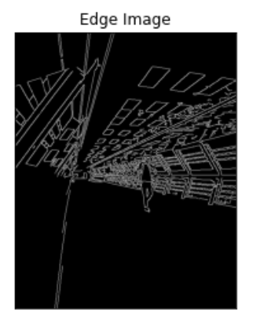
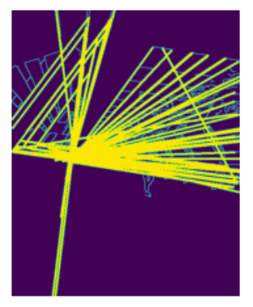

# Edge-Linking-using-Hough-Transform
## Aim:
To write a Python program to detect the lines using Hough Transform.

## Software Required:
Anaconda - Python 3.7

## Algorithm:
### Step1:
Import all the necessary modules for the program.

### Step2:
Load a image using imread() from cv2 module.

### Step3:
Convert the image to grayscale.

### Step4:
Using Canny operator from cv2,detect the edges of the image

### Step5:
Using the HoughLinesP(),detect line co-ordinates for every points in the images.Using For loop,draw the lines on the found co-ordinates.

### Step6:
Display the image and end the program.

## Program:
```Python

# Read image and convert it to grayscale image


# Find the edges in the image using canny detector and display


# Detect points that form a line using HoughLinesP


# Draw lines on the image


# Display the result


```
## Output

### Input image and grayscale image


### Canny Edge detector output


### Display the result of Hough transform


## Result:
Thus the program is written with python and OpenCV to detect lines using Hough transform. 
